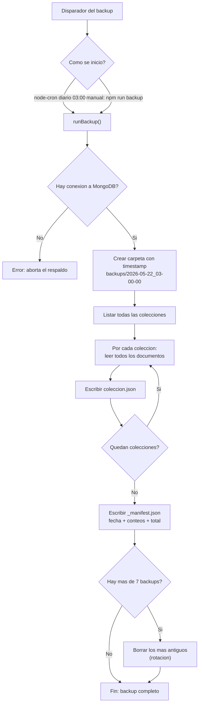
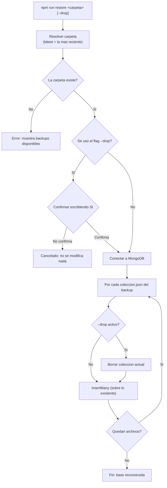
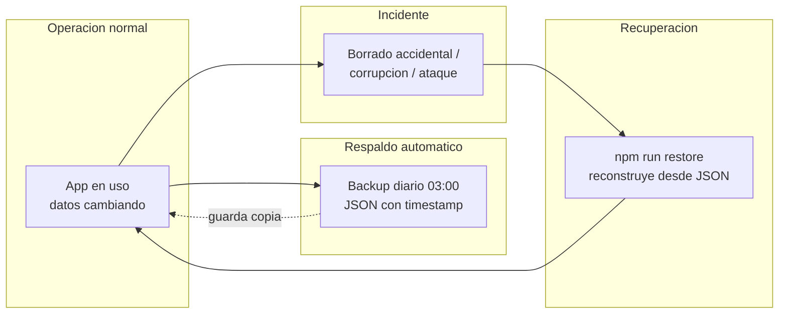

# Diagramas de flujo — Backup y Restauración (VAYO)

> Para exportar: pega SOLO el código (desde `flowchart` hasta la última línea,
> sin las comillas triples ```) en https://mermaid.live → Actions → PNG/SVG.

---

## A) Flujo de BACKUP



---

## B) Flujo de RESTAURACION



---

## C) Ciclo completo de Disaster Recovery (vista de alto nivel)


