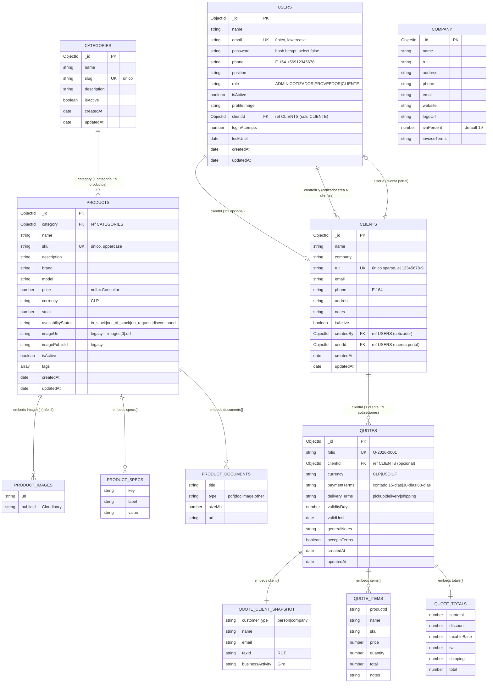

# Diagrama de Base de Datos — VAYO Solutions (MongoDB)

> **Nota conceptual para la presentación:**
> MongoDB es una base de datos **NoSQL documental**, no relacional. No existe
> "normalización" en el sentido SQL (1FN, 2FN, 3FN). En su lugar, el diseño se
> basa en dos decisiones por cada relación:
>
> | Decisión | Cuándo se usa | Ejemplo en VAYO |
> |---|---|---|
> | **Embeber** (embed) | Datos que SIEMPRE se leen juntos y pertenecen al documento | Los `items` dentro de una `Quote`, las `specs` dentro de un `Product` |
> | **Referenciar** (reference, `ObjectId`) | Entidades independientes y compartidas | Un `Product` referencia su `Category`; una `Quote` referencia su `Client` |
>
> Esto es el equivalente NoSQL de las claves foráneas (FK) de SQL.

---

## Diagrama Entidad-Relación (Mermaid)



---

## Cómo exportar el diagrama para la presentación

1. Ve a **https://mermaid.live**
2. Pega el bloque de código de arriba (lo que está entre ` ```mermaid ` y ` ``` `)
3. Botón **Actions → PNG / SVG** para descargar la imagen
4. Alternativa en VS Code: instala la extensión **"Markdown Preview Mermaid Support"** (`bierner.markdown-mermaid`) y abre este archivo en preview (Ctrl+Shift+V)

---

## Las 6 colecciones explicadas

| Colección | Tipo | Descripción |
|---|---|---|
| **users** | Maestra | Cuentas que se autentican (admin, cotizador, proveedor, cliente) |
| **clients** | Maestra | Ficha CRM de cada cliente. Puede o no tener cuenta de portal |
| **categories** | Maestra | Categorías del catálogo |
| **products** | Maestra | Catálogo de repuestos HVAC. Embebe imágenes, specs y documentos |
| **company** | Singleton | Configuración única de la empresa (IVA, datos fiscales) |
| **quotes** | Transaccional | Cotizaciones. Embebe un *snapshot* del cliente, items, totales |

## Decisiones de diseño NoSQL clave (para defender en la presentación)

1. **`Quote.client{}` es un snapshot embebido**, NO solo una referencia.
   *Por qué:* si el cliente cambia su nombre/RUT después, la cotización histórica
   debe conservar los datos tal como estaban al emitirla (integridad documental
   y legal). Aun así guardamos `clientId` como referencia para poder agrupar.

2. **`Product.images[]` está embebido** (no es colección aparte).
   *Por qué:* las imágenes de un producto siempre se leen junto al producto y
   nunca se comparten entre productos → embeber evita un JOIN.

3. **`User` ↔ `Client` referencia bidireccional 1:1.**
   *Por qué:* separa la identidad de autenticación (User) de la entidad comercial
   (Client). Un Client puede existir sin login; un User CLIENTE siempre apunta a su Client.

4. **`company` es un singleton.**
   *Por qué:* solo hay una empresa (VAYO). El controlador garantiza un único documento.
